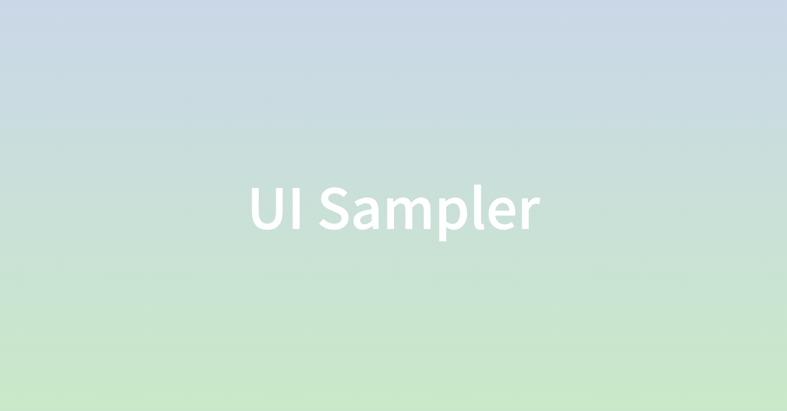

# UI Sampler

<center>

</center>

<p align="center">
   
</p>

<p align="center">
  <a href="https://srain66.github.io/ui-sampler">UI Sampler Storybook</a>
</p>

## Getting Started

### Installation

```bash
npm ci
npm run storybook
```
